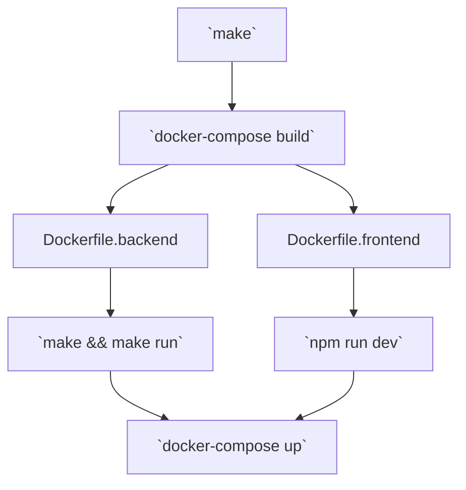

# JCK
The Java-based Chat Kit

<div class="pt-12">
  <span @click="$slidev.nav.next" class="px-2 py-1 rounded cursor-pointer" hover="bg-white bg-opacity-10">
    Premi spazio per la prossima pagina <carbon:arrow-right class="inline"/>
  </span>
</div>

---

# Cos'è JCK?
JCK è un sistema di chatting basato su WebSocket che permette agli utenti di comunicare con una chat testuale in 2 modi:

1. **DM**: Comunica con i tuoi amici in una chat privata;
2. **Public Square**: Dii la tua, come se fossi in piazza.

---

# Cos'è un WebSocket?
Un WebSocket è un protocollo di comunicazione bidirezionale che consente la comunicazione su un'unica connessione persistente TCP.
Questo significa che una volta stabilita la connessione, sia il client che il server possono inviare dati all'altro in qualsiasi momento.

I WebSocket sono particolarmente utili per applicazioni web che richiedono aggiornamenti in tempo reale, come chat online o giochi multiplayer.

Usare i WebSocket riduce la latenza e il sovraccarico della rete rispetto ad approcci come il long polling.


---
layout: two-cols
---

# Build Process
Come funziona la compilazione e come eseguire JCK

Compilare il progetto è facilissimo, basta eseguire:
```sh
make
```

Il frontend verrà aperto direttamente sulla porta `3000`.

A destra si può notare il processo che viene eseguito quando il comando `make` viene lanciato.

::right::



---

# Il Database
Abbiamo scelto di usare il database SQLite, ecco la sua struttura:
```sql
CREATE TABLE IF NOT EXISTS users (
  id INTEGER PRIMARY KEY NOT NULL,
  username VARCHAR(128) NOT NULL UNIQUE,
  password VARCHAR(256) NOT NULL
);

CREATE TABLE IF NOT EXISTS messages (
  id INTEGER PRIMARY KEY NOT NULL,
  text TEXT NOT NULL,
  sender UNSIGNED INT NOT NULL,
  recipient UNSIGNED INT NOT NULL,

  FOREIGN KEY (sender) REFERENCES users(id)
  FOREIGN KEY (recipient) REFERENCES users(id)
);
```

---

# La logica del backend
Per quanto riguarda la logica del backend preferiamo farvi vedere le parti più significative riportate sulla documentazione creata con javadoc.

[<QRCode :link="'https://paolo-garabello.github.io/jck/javadoc/'" />
https://paolo-garabello.github.io/jck/javadoc/
](javadoc/)

---

# Come funziona il client
Il client è scritto usando [sveltekit](https://kit.svelte.dev) per comodità d'uso, ma anche la console del vostro dispositivo va bene.

### Connessione
```js
const socket = new WebSocket('ws://backend:3001');
```

### Gestione degli eventi
```js
socket.onopen = (event) => {};
socket.onmessage = (event) => {};
socket.onclose = () => {};
socket.onerror = (event) => {};
```

### Invio di messaggi
```js
socket.send(JSON.stringify({...}));
```
---
layout: end
---

# Grazie dell'Attenzione
